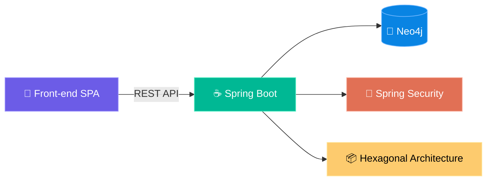

<p align="center">
  
</p>

<h1 align="center">🛒 PokéMart — E-Commerce Pokémon</h1>

<p align="center">
  <em>Gotta Buy 'Em All!</em>
</p>

<p align="center">
  
  
  
  
  
  
  
</p>

<p align="center">
  <br>
  <strong>🔗 Acesse o projeto online:</strong><br>
  <a href="https://pokemart.filpo.com.br">https://pokemart.filpo.com.br</a>
</p>

---

## 📖 Sobre o Projeto

**PokéMart** é um e-commerce completo com a temática Pokémon, desenvolvido como **projeto de portfólio** para demonstrar domínio avançado de:

- 🧠 **JavaScript Moderno (ES6+)** — Módulos nativos, async/await, desestruturação, template literals
- 🧩 **Web Components Nativos** — Componentização real da interface usando `Custom Elements` + `Shadow DOM`
- 🔀 **Roteamento SPA Client-Side** — Navegação sem reload com `History API` e `popstate`
- 🏗️ **Arquitetura de Serviços** — Camada de serviços desacoplada (`Router`, `Store`, `Cart`, `API`, `Toast`)
- 💾 **Persistência de Estado** — `localStorage` como banco de dados simulado

> **Zero frameworks. Zero bibliotecas. Zero dependências de runtime.**  
> Todo o front-end foi escrito 100% com **Vanilla JavaScript, HTML5 e CSS3**.

---

## ✨ Funcionalidades

### 🛍️ Loja & Catálogo
| Funcionalidade | Descrição |
|---|---|
| 📦 Catálogo de Produtos | Listagem completa com cards dos itens Pokémon disponíveis |
| 🔍 Filtros Dinâmicos | Busca e filtragem em tempo real por nome e categoria |
| 📄 Paginação | Navegação paginada pelo catálogo, evitando carregamento massivo |
| 🔎 Detalhes do Item | Página individual com informações detalhadas de cada produto |

### 🛒 Carrinho & Checkout
| Funcionalidade | Descrição |
|---|---|
| ➕ Carrinho de Compras | Adição/remoção de itens com atualização em tempo real do badge |
| 📊 Controle de Estoque | Validação de limite de estoque impedindo compras acima do disponível |
| ✅ Checkout de Pedidos | Finalização gera um pedido com **timestamp** exato (data + horário) |
| 📋 Histórico de Pedidos | Listagem completa de todas as compras realizadas |

### 🔐 Autenticação & Admin
| Funcionalidade | Descrição |
|---|---|
| 👤 Sistema de Login | Autenticação de usuários com rotas protegidas |
| ⚡ Acesso Rápido Demo | Botão que simula login do **Professor Carvalho** para acesso ao painel admin |
| 🛠️ Painel Administrativo | Criar, editar, pausar vendas e listar estoque com paginação |
| 🔒 Rotas Protegidas | Carrinho, pedidos e admin requerem autenticação; redirect automático para login |

### ⚙️ Geral
| Funcionalidade | Descrição |
|---|---|
| 📱 Design Responsivo | Interface adaptável para mobile e desktop com menu hamburger |
| 🗑️ Resetar Dados | Botão global que limpa todo o `localStorage` (carrinho, pedidos, estoque, usuários) |
| 🍞 Toast Notifications | Feedback visual com notificações flutuantes para ações do usuário |
| 🔄 SPA Navigation | Transições suaves entre páginas sem recarregamento do navegador |

---

## 🏛️ Arquitetura

```
PokéMart/
├── index.html              # Shell principal da SPA
├── app.js                  # Orquestrador: inicializa router, eventos globais e UI
├── styles.css              # Design system global
│
├── components/             # 🧩 Web Components (Custom Elements)
│   ├── ItemsPage.js        #    Catálogo com paginação e filtros
│   ├── ItemDetailsPage.js  #    Página de detalhes do produto
│   ├── CartPage.js         #    Carrinho de compras
│   ├── CheckoutSuccessPage.js  # Confirmação do pedido
│   ├── OrdersPage.js       #    Histórico de pedidos
│   ├── AuthPage.js         #    Login / Acesso Rápido
│   ├── AdminPage.js        #    Painel administrativo
│   ├── NotFoundPage.js     #    Página 404
│   └── BasePage.js         #    Classe base dos componentes
│
├── services/               # ⚙️ Camada de Serviços
│   ├── Router.js           #    Roteamento SPA (History API)
│   ├── Store.js            #    Gerenciamento de estado (localStorage)
│   ├── Cart.js             #    Lógica do carrinho
│   ├── Items.js            #    Operações sobre produtos
│   ├── API.js              #    Camada de abstração para API futura
│   ├── Text.js             #    Utilitários de formatação
│   └── Toast.js            #    Sistema de notificações
│
├── data/                   # 📊 Dados estáticos / seeds
├── images/                 # 🖼️ Assets visuais
├── fonts/                  # 🔤 Tipografia customizada
│
├── Dockerfile              # 🐳 Build da imagem (nginx:stable-alpine)
├── docker-compose.yml      # 🐳 Orquestração de containers
└── nginx.conf              # ⚙️ Configuração do servidor web
```

---

## 🛠️ Tecnologias

<table>
  <tr>
    <th>Camada</th>
    <th>Tecnologia</th>
    <th>Uso</th>
  </tr>
  <tr>
    <td><strong>Linguagem</strong></td>
    <td></td>
    <td>Lógica, componentes, roteamento, estado</td>
  </tr>
  <tr>
    <td><strong>Markup</strong></td>
    <td></td>
    <td>Estrutura semântica da SPA</td>
  </tr>
  <tr>
    <td><strong>Estilo</strong></td>
    <td></td>
    <td>Design system, responsividade, animações</td>
  </tr>
  <tr>
    <td><strong>Container</strong></td>
    <td></td>
    <td>Conteinerização e portabilidade</td>
  </tr>
  <tr>
    <td><strong>Web Server</strong></td>
    <td></td>
    <td>Servidor reverso, SSL, servir arquivos estáticos</td>
  </tr>
  <tr>
    <td><strong>Cloud</strong></td>
    <td></td>
    <td>Hospedagem em VM e2-micro</td>
  </tr>
  <tr>
    <td><strong>SSL</strong></td>
    <td></td>
    <td>Certificados HTTPS via Certbot</td>
  </tr>
</table>

---

## 🚀 Infraestrutura & Deploy

O projeto está **conteinerizado** e preparado para produção:

```
┌─────────────────────────────────────────────────┐
│           Google Cloud Platform (GCP)           │
│              VM e2-micro (free tier)             │
│                                                 │
│   ┌─────────────────────────────────────────┐   │
│   │          Docker Container               │   │
│   │                                         │   │
│   │   ┌─────────────────────────────────┐   │   │
│   │   │    Nginx (Reverse Proxy)        │   │   │
│   │   │    + SSL (Let's Encrypt)        │   │   │
│   │   │    + Serve Static Files         │   │   │
│   │   │                                 │   │   │
│   │   │    PokéMart SPA (Front-end)     │   │   │
│   │   └─────────────────────────────────┘   │   │
│   │                                         │   │
│   └─────────────────────────────────────────┘   │
│                                                 │
└─────────────────────────────────────────────────┘
```

- **Docker** — Imagem baseada em `nginx:stable-alpine` para build leve e eficiente
- **Docker Compose** — Orquestração simplificada com volumes para certificados SSL
- **Nginx** — Servidor reverso com configuração customizada (`nginx.conf`)
- **Let's Encrypt / Certbot** — Certificados SSL gratuitos para HTTPS
- **GCP** — Máquina Virtual `e2-micro` (free tier) no Google Cloud

---

## 💻 Como Rodar Localmente

### Pré-requisitos

- [Docker](https://docs.docker.com/get-docker/) instalado
- [Docker Compose](https://docs.docker.com/compose/install/) instalado

### Passo a passo

```bash
# 1. Clone o repositório
git clone https://github.com/mateusfilpo/pokemart.git
cd pokemart

# 2. Suba os containers
docker-compose up -d

# 3. Acesse no navegador
http://localhost:3000
```

> 💡 **Dica:** Para parar os containers, execute `docker-compose down`

### Sem Docker?

Você também pode rodar com qualquer servidor HTTP estático:

```bash
# Usando Python
python -m http.server 3000

# Ou usando o Live Server do VS Code
# Basta abrir o index.html com a extensão Live Server
```

---

## 🗺️ Roadmap — Próximos Passos

A próxima fase do PokéMart é a construção de um **back-end robusto**, transformando o projeto em uma aplicação full-stack:

| Fase | Tecnologia | Descrição |
|---|---|---|
| 🔜 **API RESTful** | Java + Spring Boot | Endpoints para produtos, carrinho, pedidos e autenticação |
| 🔜 **Banco de Dados** | Neo4j (Grafos) | Modelagem de relacionamentos entre Pokémon, tipos, categorias e pedidos |
| 🔜 **Arquitetura** | Hexagonal (Ports & Adapters) | Separação clara entre domínio, aplicação e infraestrutura |
| 📋 **Autenticação** | Spring Security + JWT | Sistema real de autenticação com tokens |
| 📋 **Testes** | JUnit 5 + Mockito | Cobertura de testes unitários e de integração |



---

## 👨‍💻 Autor

<table>
  <tr>
    <td align="center">
      
      <br />
      <strong>Mateus Filpo</strong>
      <br />
      <em>Desenvolvedor Full Stack</em>
      <br /><br />
      <a href="https://linkedin.com/in/mateusfilpo">
        
      </a>
      <a href="https://github.com/mateusfilpo">
        
      </a>
    </td>
  </tr>
</table>

---

<p align="center">
  
  <br /><br />
  <em>⭐ Se este projeto te ajudou ou te inspirou, deixe uma estrela!</em>
</p>
